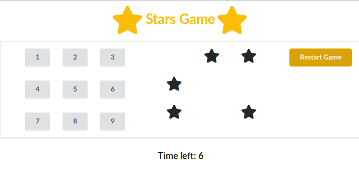

#REACT STARS GAME 

## RULES
You have to match the number of stars in the left.
A value is matched if the sum of these digits is equal to the number stars. These buttons will be blocked and can't be used any more.
A button can be used once.
You have to use all the buttons within the time.
## INSTALLATION
1) Start by installing the dependencies
$ npm install
2) Run the server
$ npm start
